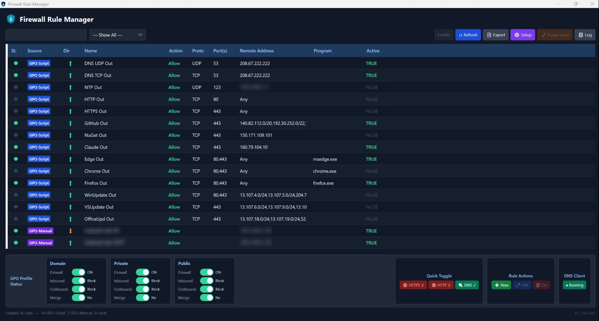

# FirewallManager

A Windows desktop tool for power users and administrators who run their machine on a **deny-by-default** firewall posture and want repeatable, auditable, and reversible control over Windows Firewall state.

FirewallManager reads and writes firewall rules and profile policy **directly from the registry** — both the Group Policy store and the local store — instead of going through `netsh` or the MMC snap-in. It surfaces the full rule set in one place, tells you where each rule came from, lets you edit or toggle them, and pairs the whole thing with a firewall-log viewer that separates real traffic from background noise.

> **This is a power tool.** It modifies the same registry locations that govern your machine's network security. A wrong rule can lock you out of the network or expose a service you meant to keep closed. It is built for people who already understand Windows Firewall and want a faster, more legible way to drive it.



---

## Features

### Rule browser & editor
- Lists every firewall rule from both the **GPO policy store** (`SOFTWARE\Policies\Microsoft\WindowsFirewall\FirewallRules`) and the **local store** (`SYSTEM\...\SharedAccess\Parameters\FirewallPolicy\FirewallRules`).
- Each rule shows direction, action, protocol, ports, remote address, program, active state, and **source** — so you can tell a script-managed rule from a manually-created GPO rule from a local rule at a glance.
- Create, edit, duplicate, enable/disable, and delete rules. GPO-Manual rules are shown **read-only** to avoid clobbering policy you didn't author here.
- Search and filter (enabled only, disabled only, block only, by direction, and so on).
- Export the current rule list to a plain-text report.

### Profile status & toggles
- Per-profile view of `EnableFirewall`, `DefaultInboundAction`, and `DefaultOutboundAction`.
- Each setting renders as a safe/unsafe pill you can click to flip, with the "safe" state (firewall on, inbound block, outbound block) clearly marked.
- Runs `gpupdate` after policy-store changes so edits take effect without a manual refresh.

### Setup wizard
- On first run, auto-detects your own IP, gateway, and DNS from the live network; on later runs, it loads from your existing `CUSTOM_` rules so your configuration round-trips.
- Helps stand up a curated set of outbound allow rules (HTTP/HTTPS, NTP, DNS, common service endpoints, etc.) for a locked-down box, including optional per-program and DNS-restriction rules.
- DNS server presets (Cloudflare, Google, Quad9, OpenDNS, or auto-gateway) are offered from configuration rather than hardcoded.

### Firewall log viewer
- Parses `pfirewall.log` and presents it as a readable, filterable table.
- **Noise suppression**: multicast, broadcast, link-local, NetBIOS, mDNS, SSDP/WSD, LLMNR, loopback, and traffic to your *configured* DNS resolvers are filtered out by default so the log starts clean.
- **DNS tripwire**: DNS traffic to a resolver you did **not** configure is flagged rather than hidden — dropped-but-unexpected in amber, allowed-but-unexpected in red — which is exactly what you want to notice on a deny-by-default machine.
- **Rule inference**: `pfirewall.log` records the packet but not which rule matched it, so the viewer re-derives the likely `CUSTOM_` rule by matching destination IP, port, protocol, and direction. It distinguishes a rule that actively allowed traffic from a *disabled* rule that would have allowed it.
- **Org tagging**: destination IPs are tagged by known address-prefix ranges (GitHub, Cloudflare, Fastly, Microsoft, etc.) to make the log easier to read at a glance.

### Configuration that survives editing
All of the app's "knowledge" — noise predicates, DNS presets, service CIDR ranges, and org tags — lives in an external `config.json` next to the executable. See [Configuration](#configuration) below.

### One-time consent gate
On first launch the app requires you to acknowledge what it does and accept responsibility before it will open. The acknowledgment is stored per-user and can be reviewed later.

---

## Requirements

- **Windows** (x64).
- **.NET 8 SDK** to build, or the **.NET 8 Desktop Runtime** to run a published build.
- **Administrator privileges.** The app manifest requests elevation (`requireAdministrator`) because it reads and writes machine-level firewall policy. It will prompt for elevation on launch.

---

## Building

```powershell
# from the repository root
dotnet build -c Release

# or run directly
dotnet run -c Release
```

To produce a self-contained, single-file build:

```powershell
dotnet publish -c Release -r win-x64 --self-contained true `
  -p:PublishSingleFile=true
```

The project targets `net8.0-windows`, uses WPF, and is x64-only. It has no external NuGet dependencies.

---

## Configuration

`FirewallManager` looks for a `config.json` file **next to the executable**. This file is optional.

- **Present and valid** → the app uses it.
- **Missing** → the app runs on a compiled-in baseline (a complete, working default).
- **Corrupt or unparseable** → the app falls back to the baseline and warns you once.

The config holds four sections:

| Section       | What it controls                                                        |
|---------------|-------------------------------------------------------------------------|
| `noise`       | Predicates for which log traffic counts as background noise.            |
| `dnsPresets`  | The DNS server choices offered in Setup.                                |
| `services`    | Named CIDR ranges (e.g. GitHub, Windows Update) for allow rules.        |
| `orgTags`     | Address-prefix → label mappings for tagging log entries.                |

### Why your edits don't get falsely flagged

Config loading is deliberately tolerant of *how the file is stored* and strict only about *what it means*. The app parses `config.json` into a typed model and hashes a **canonical** serialization of that model (UTF-8 without BOM, LF line endings, fixed key order). That means CRLF vs LF, a UTF-8 BOM, trailing whitespace, indentation, and key order **never** change the hash — only a real change to a value does.

When your `config.json` differs from the baseline, the app surfaces the differences **per section** the next time you open Setup and lets you choose, section by section, whether to use your file's values or the built-in defaults. This prompt is hash-gated, so an unchanged config never nags you again. Values that can't represent a real address (bad IPv4 octets, out-of-range CIDR prefixes) are rejected as *impossible* — distinct from values that are merely risky, which remain your call.

You can export the current baseline as an editable starting template from within the app.

---

## How it stores its own settings

App-level state — the consent acknowledgment, the config hash, and your per-section config decisions — is stored under `HKEY_CURRENT_USER\Software\GeekFirewallManager`. Nothing about the app's own preferences is written to machine-level keys.

---

## A note on safety

FirewallManager edits live firewall policy. A few habits worth keeping:

- **Know how you'll recover.** Have a way back in (console access, a second admin path, or a known-good rule export) before you make sweeping changes.
- **Export before large edits.** Use the rule export to capture the current state so you can compare or rebuild.
- **Watch the source column.** Rules originating from Group Policy may be re-applied or overwritten by your domain/policy infrastructure independently of this tool.

The software is provided as-is; you are responsible for the changes you apply to your own system.

---

## License

Released under the MIT License. See [`LICENSE.txt`](LICENSE.txt).